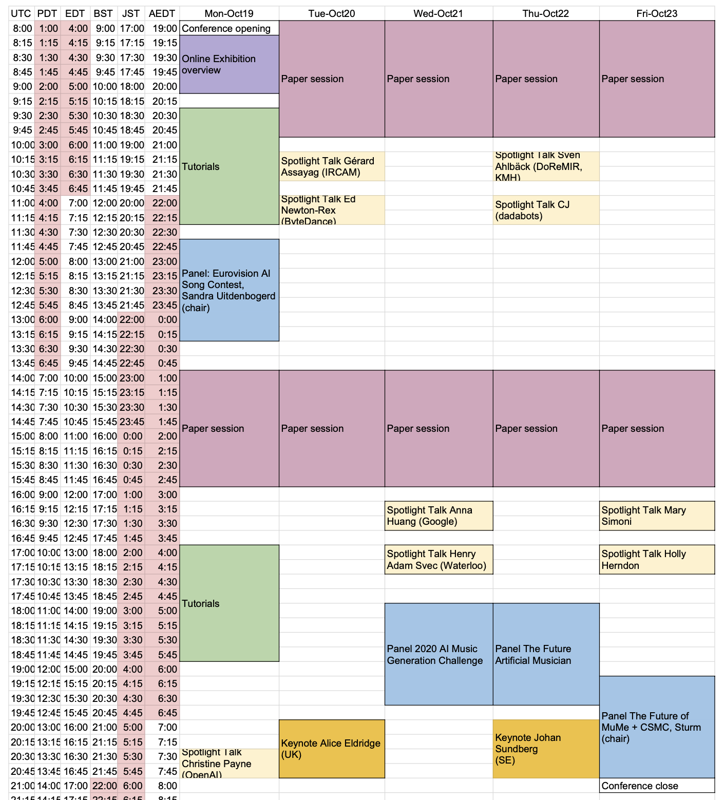

# Provisional Schedule

---

# Tutorials

1. Samuel Hunt (UWE Bristol, UK): This tutorial introduces participants to the [Interactive Generative Music Environment (IGME)](http://samhunt.panel.uwe.ac.uk/) and demonstrates the ease at which generative music compositions can be created, without domain specific knowledge of either generative music or programming constructs. IGME attempts to bridge the gap between generative music theory and accessible music sequencing software, through an easy to use score editing (or piano roll) interface. IGME is available free of charge and works on Windows and Mac OS. It is hoped that participants will learn about generative music so that they understand how to utilize them in their own composition practice. 
2. Bob L. T. Sturm (KTH, Sweden): This tutorial introduces participants to AI-generated folk music through practice. Two AI-generated folk tunes will be taught aurally and discussed. Participants should be comfortable with their musical instrument of choice and be able to learn by ear (but music notation will be provided). The two tunes will be taught gradually by repeating small phrases and combining them to form the parts. Sturm will lead the session with his accordion.

# Panels

1. **The Future AI Musician**: Oded Ben-Tal (chair), Mark d'Inverno, Georgina Born, Elaine Chew, and Prateek Verma
2. **How Do we Rage with the Machine? Exploring the AI Song Space**: Alexandra L. Uitdenbogerd (chair), Hendrik Vincent Koops, Anna Huang, Portrait XO, Ashley Burgoyne, and Tom Collins
3. **The Future of MuMe + CSMC**: Bob L. T. Sturm (chair), Philippe Pasquier, Oliver Bown, Robin Laney, Róisín Loughran, Steven Jan
4. **AI Music Generation Challenge 2020**: Bob L. T. Sturm (chair), Judge A, Judge B, Judge C, Judge D, Participant TBA

# Papers
