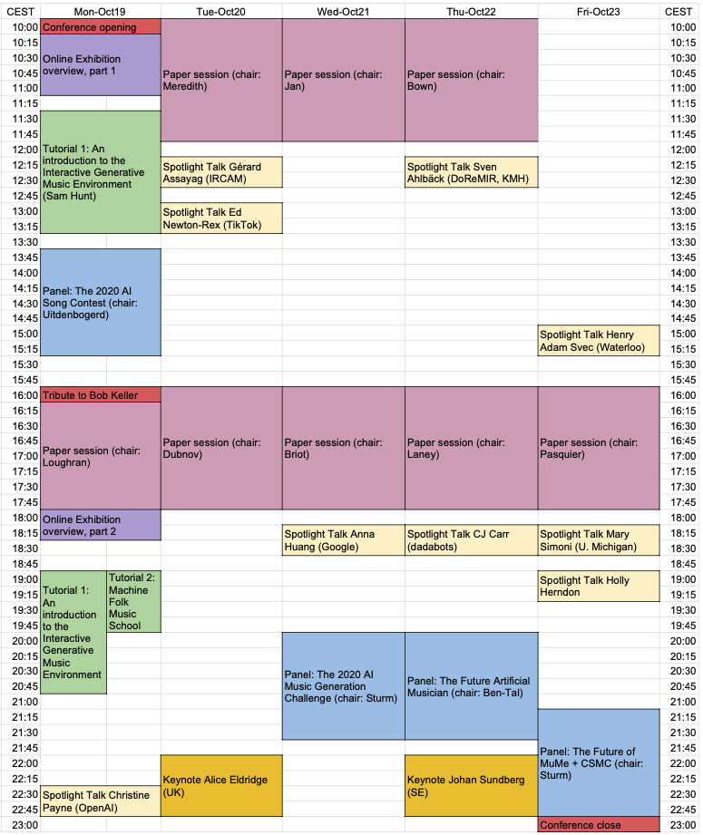

# Schedule

---

# Keynotes

  (Photo credit: Agata Urbaniak)

[Dr. Alice Eldridge](https://profiles.sussex.ac.uk/p127749-alice-eldridge),
**Computer music stimulation of human creativity: techno-musicking as lab for inner and outer worlding**

Various convincing evolutionary theories across science and humanities posit a central role for musicking in the evolution of social, biological and technical patterns of modern humanity. In our contemporary milieu - one of existential, ecological etc. crises - musical experimentation plays a similarly critical role in providing a free and fertile space for making sense of the world, ourselves and our emerging technologies. In this talk I’ll share a range of projects from singing cybernetic homeostats and ecosystemic evolutionary art, through feedback cellos to acoustic biodiversity assessment to illustrate some of the ways that techno-musicking plays a creative role in ways of knowing and making our selves and our worlds.

[Dr. Alice Eldridge](https://profiles.sussex.ac.uk/p127749-alice-eldridge) is interested in how sound organises systems. Her research cross-fertilises ideas and methods from music, cognitive science, technology & ecology to develop biologically-inspired approaches to new musical instruments, and acoustic methods for conservation, within the emerging science of ecoacoustics. She holds a BSc in Psychology, an MSc in Evolutionary and Adaptive Systems and a PhD in Computer Science and AI and is currently Lecturer in Music Technology at the University of Sussex, where she is Co-Director of the Sussex Humanities Lab. Alice has appeared on BBC TV and BBC 4 as a soundscape ecologist; on BBC 3 as a free jazz cellist; on BBC 6 show as a contemporary chamber composer; and on BBC 1 John Peel show as a pop bassist. [www.ecila.org](http://www.ecila.org)

[Professor Emeritus Dr. Johan Sundberg](https://scholar.google.co.uk/citations?user=UXXUEcoAAAAJ&hl=en&oi=ao), 
**Analysis by synthesis: A wonderful tool in difficult areas**

Analysis by synthesis is a classical tool in many areas of research. I will talk about how I enjoyed using it in three research areas. In one, Björn Lindblom and I applied it in a study of the compositional style in nursery tunes composed by the Swedish composer Alice Tegner in the beginning of the 20th century.  A second application was music performance, where musician Larf Frydén, Anders Friberg and I developed a digital performance grammar that controlled a synthesizer; thus, the synthesizer performed music examples in accordance with a set of performance rules. A third area has been the singing voice, the purpose being to explore how various acoustic properties affect the sound of a singer’s voice.

Johan Sundberg (born in 1936, Ph.D. in musicology Uppsala University 1966, doctor honoris causae 1996 University of York, UK) has a personal Chair (Emeritus) in Music Acoustics at the department of Speech Music and Hearing (KTH), Royal Institute of Technology, Stockholm. He early became interested in the acoustical aspects of music, starting with a doctoral dissertation work on organ pipes. After the dissertation, singing voice and music performance have been his main research topics. He led the music acoustics research group from 1970 to 2004. In Musikens Ljudlära (The science of Musical Sounds) Sundberg presents music acoustics in popularized form to the interested layman. In Röstlära (The Science of the Singing Voice) Sundberg explains functional anatomy as well as vocal acoustics. Both texts have been seminal works in the field of voice science.

---

# Spotlights

2. [Christine Payne, OpenAI](http://christinemcleavey.com) *Jukebox and MuseNet: Training Neural Nets to Generate New Music*
2. [Gérard Assayag, IRCAM](https://www.ircam.fr/person/gerard-assayag)
2. [Ed Newton-Rex, TikTok](https://www.linkedin.com/in/ed-newton-rex): *From Lab to Market: Building AI Composition Products*
> AI composition has come a long way, and the technology is starting to write convincing music. But to what end? Technology serves little purpose if it isn't used. In this talk, we look at the range of products that AI composition technology has been applied to, what some of the pitfalls are when moving from research to product development in this nascent field, and what to think about when designing AI composition products.
2. [Anna Huang, Google](https://research.google/people/105787)
2. [Henry Adam Svec, University of Waterloo](http://www.henryadamsvec.ca) *“Gonna Burn All My Bridges”: LIVINGSTON’s Artificially Intelligent Folk Songs of Canada and an Alternative Way Forward in A.I. Research*
> Decades of discovery in the field of artificial intelligence have prioritized intelligence as the lodestar of research and development. What if folkloristic authenticity was substituted as the guiding goal of our collective labours? In this playful performance, involving both storytelling and song, Henry Adam Svec will explore this and other questions through the recounting of a most unlikely scenario—the time when, in Dawson City, Yukon, he co-invented the world’s first artificially intelligent database of Canadian folksong.
2. [Professor Sven Ahlbäck, KMH + DoReMIR](https://scorecloud.com) *What does AI learn from music?: On the problem of ground truth in music and the power of concepts*
> Many AI applications on music relates to music theoretical models, in the sense of musical concepts and ideas of how music works, that are not always made explicit, explicitly discussed or questioned. Already the choice of representations of music and sound as well as the selection of data for training models can influence models and creative output greatly. Here we will give some examples of problems arising when modelling basic musical features, from the experience of developing  automatic music notation.
2. [CJ Carr (dadabots)](https://dadabots.com)
1. [Holly Herndon](https://www.hollyherndon.com)
2. [Professor Mary Simoni, Rensselaer Polytechnic Institute](https://faculty.rpi.edu/node/35920)

---
# Tutorials

1. Samuel Hunt (UWE Bristol, UK): This tutorial introduces participants to the [Interactive Generative Music Environment (IGME)](http://samhunt.panel.uwe.ac.uk/) and demonstrates the ease at which generative music compositions can be created, without domain specific knowledge of either generative music or programming constructs. IGME attempts to bridge the gap between generative music theory and accessible music sequencing software, through an easy to use score editing (or piano roll) interface. IGME is available free of charge and works on Windows and Mac OS. It is hoped that participants will learn about generative music so that they understand how to utilize them in their own composition practice. [Link](https://ca.bbcollab.com/guest/a818ce90b182432b9f8f8fe0f0bb8430) to tutorial.
2. Bob L. T. Sturm (KTH, Sweden): This tutorial introduces participants to AI-generated folk music through practice. Two AI-generated folk tunes will be taught aurally and discussed. Participants should be comfortable with their musical instrument of choice and be able to learn by ear (but music notation will be provided). The two tunes will be taught gradually by repeating small phrases and combining them to form the parts. Sturm will lead the session with his accordion. <a href="MFtunes.pdf" download>Here's the tunebook.</a>

---
# Panels

2. **How Do we Rage with the Machine? Exploring the AI Song Space**: Alexandra L. Uitdenbogerd (chair), Hendrik Vincent Koops, Anna Huang, Portrait XO, Ashley Burgoyne, and Tom Collins
4. **AI Music Generation Challenge 2020**: Bob L. T. Sturm (chair), Judge A, Judge B, Judge C, Judge D, James Owers (participant)
1. **The Future AI Musician**: Oded Ben-Tal (chair), Mark d'Inverno, Mary Simoni, Elaine Chew, and Prateek Verma
3. **The Future of MuMe + CSMC**: Bob L. T. Sturm (chair), Philippe Pasquier, Oliver Bown, Robin Laney, Róisín Loughran, Steven Jan, Artemi-Maria Gioti

---
# Papers 

**Published with ISBN 978-91-519-5560-5**

_MON OCT 19 16-18 CEST (Chair: Róisín Loughran)_

> Tribute to [Professor Robert Keller](https://www.cs.hmc.edu/~keller/)

> Matthew Caren. TRoco: A generative algorithm using jazz music theory [pdf](papers/CSMC__MuMe_2020_paper_7.pdf)

> Jean-Francois Charles, Gil Dori and Joseph Norman. Sonic Print: Timbre Classification with Live Training for Musical Applications [pdf](papers/CSMC__MuMe_2020_paper_8.pdf)

> Jeffrey Ens and Philippe Pasquier. Improved Listening Experiment Design for Generative Systems [pdf](papers/CSMC__MuMe_2020_paper_17.pdf)

> DEMO Joaquin Jimenez. Creating a Machine Learning Assistant for the Real-Time Performance of Dub Music [pdf](papers/CSMC__MuMe_2020_paper_34.pdf)

_TUE OCT 20 10-12 CEST (Chair: David Meredith)_

> Rui Guo, Ivor Simpson, Thor Magnusson and Dorien Herremans. Symbolic music generation with tension control [pdf](papers/CSMC__MuMe_2020_paper_47.pdf)

> Zeng Ren. Style Composition With An Evolutionary Algorithm [pdf](papers/CSMC__MuMe_2020_paper_11.pdf)

> Raymond Whorley and Robin Laney. Generating Subjects for Pieces in the Style of Bach’s Two-Part Inventions [pdf](papers/CSMC__MuMe_2020_paper_1.pdf)

> Jacopo de Berardinis, Samuel Barrett, Angelo Cangelosi and Eduardo Coutinho. Modelling long- and short-term structure in symbolic music with attention and recurrence [pdf](papers/CSMC__MuMe_2020_paper_46.pdf)

> WIP Aiko Uemura and Tetsuro Kitahara. Morphing-Based Reharmonization using LSTM-VAE [pdf](papers/CSMC__MuMe_2020_paper_25.pdf)

> DEMO Richard Savery, Lisa Zahray and Gil Weinberg. ProsodyCVAE: A Conditional Convolutional Variational Autoencoder for Real-time Emotional Music Prosody Generation [pdf](papers/CSMC__MuMe_2020_paper_16.pdf)

_TUE OCT 20 16-18 CEST (Chair: Shlomo Dubnov)_

> Carmine-Emanuele Cella, Luke Dzwonczyk, Alejandro Saldarriaga-Fuertes, Hongfu Liu and Helene-Camille Crayencour. A Study on Neural Models for Target-Based Computer-Assisted Musical Orchestration [pdf](papers/CSMC__MuMe_2020_paper_43.pdf)

> Sofy Yuditskaya, Sophia Sun and Derek Kwan. Karaoke of Dreams: A multi-modal neural-network generated music experience [pdf](papers/CSMC__MuMe_2020_paper_5.pdf)

> Guillaume Alain, Maxime Chevalier-Boisvert, Frederic Osterrath and Remi Piche-Taillefer. DeepDrummer : Generating Drum Loops using Deep Learning and a Human in the Loop [pdf](papers/CSMC__MuMe_2020_paper_18.pdf)

> Yijun Zhou, Yuki Koyama, Masataka Goto and Takeo Igarashi. Generative Melody Composition with Human-in-the-Loop Bayesian Optimization [pdf](papers/CSMC__MuMe_2020_paper_21.pdf)

> WIP Joann Ching, Antonio Ramires and Yi-Hsuan Yang. Instrument Role Classification: Auto-tagging for Loop Based Music [pdf](papers/CSMC__MuMe_2020_paper_35.pdf)

_WED OCT 21 10-12 CEST (Chair: Steven Jan)_

> DEMO Roger Dean. The multi-tuned piano: keyboard music without a tuning system generated manually or by Deep Improviser [pdf](papers/CSMC__MuMe_2020_paper_22.pdf)

> Stefano Kalonaris and Anna Aljanaki. Meet HER: A Language-based Approach to Generative Music Systems Evaluation [pdf](papers/CSMC__MuMe_2020_paper_4.pdf)

> Mio Kusachi, Aiko Uemura and Tetsuro Kitahara. A Piano Ballad Arrangement System [pdf](papers/CSMC__MuMe_2020_paper_41.pdf)

> Mathias Rose Bjare and David Meredith. Sequence Generative Adversarial Networks for Music Generation with Maximum Entropy Reinforcement Learning [pdf](papers/CSMC__MuMe_2020_paper_20.pdf)

> Liam Dallas and Fabio Morreale. Effects of Added Vocals and Human Production to AI-composed Music on Listener’s Appreciation [pdf](papers/CSMC__MuMe_2020_paper_23.pdf)

> WIP Sutirtha Chakraborty, Shyam Kishor, Shubham Nikesh Patil and Joseph Timoney. LeaderSTeM-A LSTM model for dynamic leader identification within musical streams [pdf](papers/CSMC__MuMe_2020_paper_52.pdf)

_WED OCT 21 16-18 CEST (Chair: Jean-Pierre Briot)_

> Nick Collins, Vit Ruzicka and Mick Grierson. Remixing AIs: mind swaps, hybrainity, and splicing musical models [pdf](papers/CSMC__MuMe_2020_paper_2.pdf)

> Lonce Wyse and Muhammad Huzaifah. Deep learning models for generating audio textures [pdf](papers/CSMC__MuMe_2020_paper_36.pdf)

> Nicolas Jonason, Bob L. T. Sturm and Carl Thomé. The control-synthesis approach for making expressive and controllable neural music synthesizers [pdf](papers/CSMC__MuMe_2020_paper_29.pdf)

> Mathieu Prang and Philippe Esling. Signal-domain representation of symbolic music for learning embedding spaces [pdf](papers/CSMC__MuMe_2020_paper_44.pdf)

> WIP Foteini Simistira Liwicki, Marcus Liwicki, Pedro Malo Perise, Federico Ghelli Visi and Stefan Ostersjo. Analysing Musical Performance in Videos Using Deep Neural Networks [pdf](papers/CSMC__MuMe_2020_paper_24.pdf)

_THU OCT 22 10-12 CEST (Chair: Ollie Bown)_

> Amir Salimi and Abram Hindle. Make Your Own Audience: Virtual Listeners Can Filter Generated Drum Programs [pdf](papers/CSMC__MuMe_2020_paper_50.pdf)

> Grigore Burloiu. Interactive Learning of Microtiming in an Expressive Drum Machine [pdf](papers/CSMC__MuMe_2020_paper_30.pdf)

> Germán Ruiz-Marcos, Alistair Willis and Robin Laney. Automatically calculating tonal tension [pdf](papers/CSMC__MuMe_2020_paper_27.pdf)

> Hadrien Foroughmand and Geoffroy Peeters. Extending Deep Rhythm for Tempo and Genre Estimation Using Complex Convolutions, Multitask Learning and Multi-input Network [pdf](papers/CSMC__MuMe_2020_paper_39.pdf)

> DEMO James Bradbury. Computer-assisted corpus exploration with UMAP and agglomerative clustering [pdf](papers/CSMC__MuMe_2020_paper_6.pdf)

_THU OCT 22 16-18 CEST (Chair: Robin Laney)_

> Shlomo Dubnov. Deep Music Information Dynamics [pdf](papers/CSMC__MuMe_2020_paper_15.pdf)

> Shuqi Dai, Huan Zhang and Roger Dannenberg. Automatic Detection of Hierarchical Structure and Influence of Structure on Melody, Harmony and Rhythm in Popular Music [pdf](papers/CSMC__MuMe_2020_paper_32.pdf)

> Brendan O'Connor, Simon Dixon and George Fazekas. An Exploratory Study on Perceptual Spaces of the Singing Voice [pdf](papers/CSMC__MuMe_2020_paper_38.pdf)

> Théis Bazin, Gaëtan Hadjeres, Philippe Esling and Mikhail Malt. Spectrogram Inpainting for Interactive Generation of Instrument Sounds [pdf](papers/CSMC__MuMe_2020_paper_49.pdf)

> WIP Manos Plitsis, Kosmas Kritsis, Maximos Kaliakatsos-Papakostas, Aggelos Pikrakis and Vassilis Katsouros. Towards a Classification and Evaluation of Symbolic Music Encodings for RNN Music Generation [pdf](papers/CSMC__MuMe_2020_paper_53.pdf)

_FRI OCT 23 16-18 CEST (Chair: Philippe Pasquier)_

> Sandeep Dasari and Jason Freeman. Directed Evolution in Live Coding Music Performance [pdf](papers/CSMC__MuMe_2020_paper_14.pdf)

> Fred Bruford, Skot McDonald and Mark Sandler. jaki: User-Controllable Generation of Drum Patterns using LSTM Encoder-Decoder and Deep Reinforcement Learning [pdf](papers/CSMC__MuMe_2020_paper_37.pdf)

> Hayato Sumino, Adrien Bitton, Lisa Kawai, Philippe Esling and Tatsuya Harada. Automatic Music Transcription and Instrument Transposition with Differentiable Rendering [pdf](papers/CSMC__MuMe_2020_paper_31.pdf)

> WIP Darrell Conklin and Geert Maessen. Aspects of pattern discovery for Mozarabic chant realization [pdf](papers/CSMC__MuMe_2020_paper_42.pdf)

> WIP Samuel Hunt. An Analysis of Repetition in Video Game Music [pdf](papers/CSMC__MuMe_2020_paper_10.pdf)

> WIP Gabriel Vigliensoni, Louis McCallum, Esteban Maestre and Rebecca Fiebrink. Generation and visualization of rhythmic latent spaces [pdf](papers/CSMC__MuMe_2020_paper_13.pdf)
